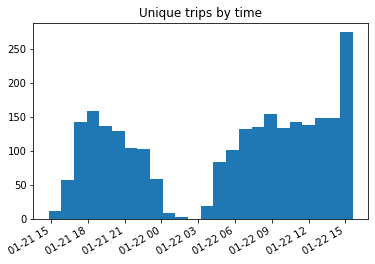
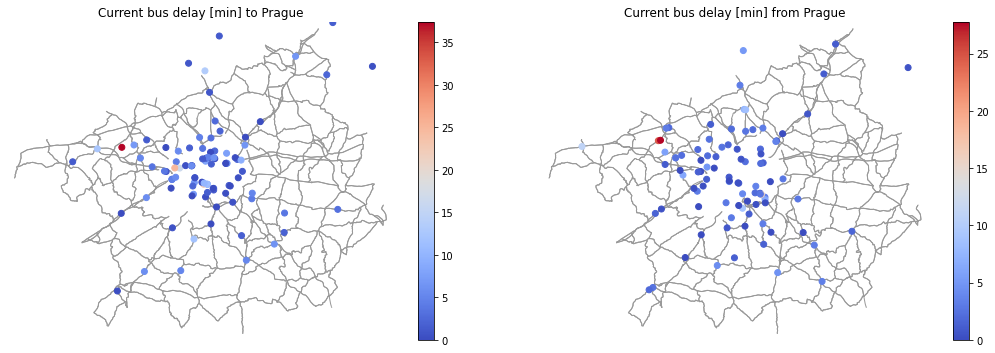
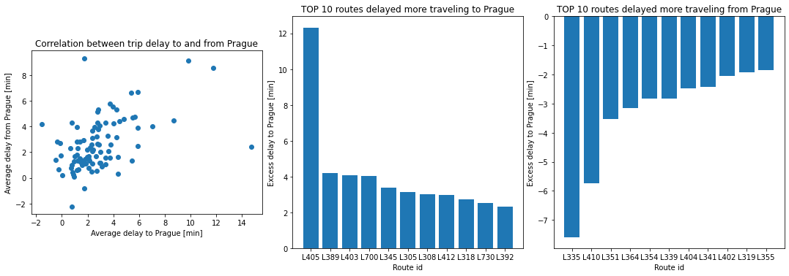
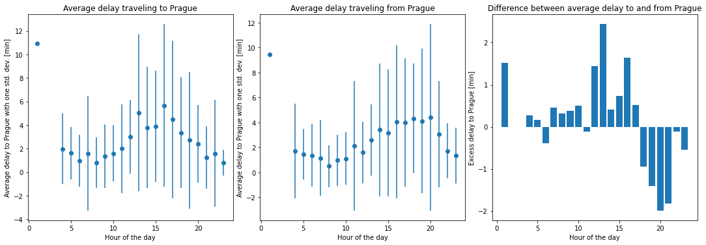

# pid-delay-map
Map of delays of Prague public transport. Seminar work for the [Big Data Technologies](https://cw.fel.cvut.cz/wiki/courses/b0m33bdt/) course at FEE CTU.

Author: zahrape9@fel.cvut.cz

Topic: 4 - *Differences by direction of travel - to and from Prague*

This document is a commentary to the work and highlights the main results. See the whole notebook in [delays.ipynb](delays.ipynb).

## Technologies

Server: Azure Databrics with Spark, Hive, HDFS

Visualizations: Python, PySpark, NumPy, Matplotlib, OSMnx, OpenStreetMap

## Source data

I used `regbuses` stream from the Kafka server, which contains live position of regional buses around Prague.
Over the weekend January 21st, 22nd I collected 27 hour of data (more than 200 000 data points).

Incoming data was saved to the Hive table `regbuses` in append mode.
The notebook can be run in Databricks reading live data and rendering visualizations on demand (calculation takes seconds).

## Data manipulation

Since there is no information about route stops in the stream, I decided to create our own route list from the data.

A route is considered *Praguish* if there ever was a bus ending in `%Praha%`.
I found 92 *Praguish* routes.

A trip is considered *to Prague* if it is on a *Praguish* route and the headsign reads `%Praha%`.
A trip is considered *from Prague* if it is on a *Praguish* route and the headsign does not read `%Praha%`.
I found more than 1200 trips in each direction.

For each trip I recorded the last `delay.actual` sent.
This is the value used in the following calculations.

The last recorder delay for all trips within the last 30 minutes looks like this:

## Results

I analyzed the difference between delay *to Prague* and *from Prague* by line and by hour of the day.

While there are usually several buses delayed 30+ minutes on the map, the average delay is about two minutes only.

The line 405 (Žatec -> Praha-Zličín) in on average delayed 12 minutes more than in the opposite direction making it the line with the highest delay excess *to Prague*.

The line 335 (Praha-Budějovická -> Kamenice) in on average delayed 7.5 minutes more than in the opposite direction making it the line with the highest delay excess *from Prague*.

When looking on the average delay though the day, we see that despite a large variance there is a peak in delay in afternoon hours in both directions.
There is also a slight excess in delays *to Prague* in the afternoon and *from Prague* in the evening.

## Future work

The proposed script should scale fairly well with more data.
Then, the storage and queries could be optimized ho visualize months of data.

More map visualization could be added, such as map of places where the average delay (or excess delay) is the highest.

Better detector of *Praguish* routes could be created or extended on other cities as well.